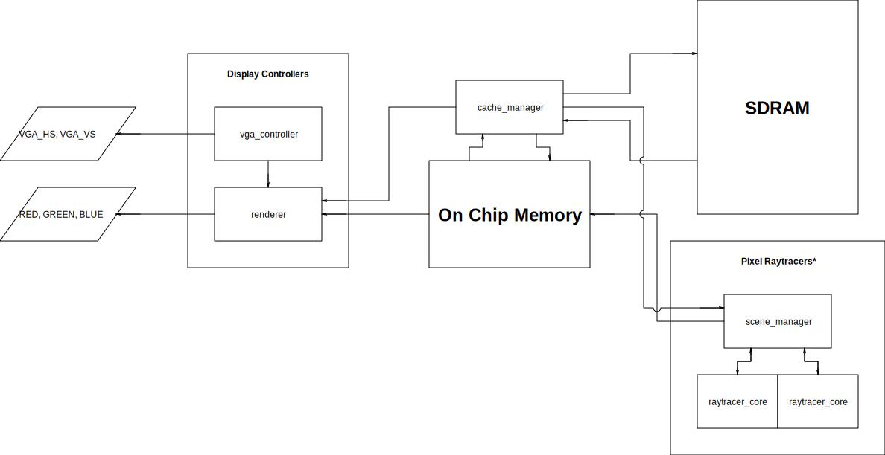

# Final Project Proposal

**Anantajit Subrahmanya**

## Idea and Overview

At a high level, the goal of my final project is to design hardware that can render a 3D scene in real-time while consuming very little power. The most basic version of this project will display a scene composed of spheres onto a monitor through a VGA interface. The intended resolution for this project is 640 x 480, and frames should update at least 20 times per second. Because this is intended to be a hardware module, there should be no use of software for rendering out a scene (that is, a scene is completely rendered in hardware). In terms of the rendering method, backwards ray-tracing will be used. Raytracing is a method which simulates how photons travel from light sources, bounce, scatter or absorb on differently colored surfaces, and are detected by the eye. Backwards ray-tracing is a computational optimization which works by reversing this: photon detectors are emitted from a virtual "eye" (camera) and will bounce, scatter and absorb into different subjects within a scene until they reach light sources. For the most basic version of this project, the maximum number of bounces will be 0 (no reflections, diffusion, etc). 

For the final demo, aside from a DE-10 Lite FPGA, VGA monitor and VGA cable, no additional equipment will be needed. For the basic demo, the FPGA will be plugged into a monitor and flashed with the FPGA image. The monitor will then show a single sphere on the screen with different shading to indicate non-uniform lighting due to a light source off camera. Diagnostic data from the VGA monitor can be used to determine the frame rate, which should exceed 20Hz. 

## Block Diagram

This is a block diagram of the most simplified model for the 3D rendering hardware. The output signals are shown above. Note that there is no specific input signal for the most basic version of this project. The Display Controllers modules are used together to generate the output VGA signals. The new "renderer" is used to pull the required pixel stored from On Chip Memory (OCM) and generate the appropriate RGB values for that pixel. We use a combination of SDRAM and OCM for this project because the entire screen data cannot fit within OCM. The "cache\_manager" module handles copying data from SDRAM to OCM and from OCM to SDRAM in a predictable manner, so the pixels that need to be drawn at any given time are always available in OCM for the Display Controllers to use. Finally, the Pixel Raytracers will calculate the values of each individual pixel and write them to OCM. This is achieved by the scene manager determining the initial ray that corresponds to each pixel. A series of raytracer\_core modules then compute if this ray intersects the sphere in the scene at any point. If an intersection is found, then the raytracer\_core will return RGB values corresponding to that point on the sphere, and the scene\_manager will update the corresponding pixel in OCM. Note that the cache\_manager connects to the renderer and scene\_manager. This is to ensure that the rendering and pixel computation process know which pixels are available in OCM. The Pixel Raytracers may change significantly in structure to accomodate additional features.

We discuss the mechanisms for raytracing logic in greater detail in this paragraph. These modules are currently consolidated as "raytracing cores" in the block diagram above, but may be broken into many smaller modules that are optimized for linear algebra operations in the future. The raytracer core is a small state machine that performs a series of linear algebra computations. In the initial state, the core is supplied with a set of registers which describe an initial position and slope of a ray of light. The core then computes intersection with any of the spheres in the scene. This can be achieved by computing the shortest distance between the the sphere center. It is forseen that measuring magnitudes of vectors may be challenging due to the lack of hard-logic for division and floating point on the FPGA. Without working with shadows, the ray tracing core will then send a bright color for areas occupied by objects and send black color if there is no object "seen" by the pixel. 

## List of Features

### Baseline Features

- A full frame (640 x 480, with 12 bits of RGB color per pixel) is cached in SDRAM and drawn by the display controllers. Understand that this requires all components within the block diagram to work with the exception of the Pixel Raytracers. To test this result, a checkerboard pattern will be written into SDRAM and drawn onto the screen. 
- The Pixel Raytracers have the ability to draw pixels on the screen in a controlled manner with quasi-predictable timing. To test this feature, the scene manager will be modified to draw an animated square that can translate across the screen. Note that the previous checkerboard test will need to pass before attempting this test. Note that no synchronization should be required between the rendering and pixel raytracing logic.
- The raytracer cores should be able to draw a "rasterized" image of the sphere on the screen (rasterized since there are no bounce and scatter computations yet). If this feature is implemented, the screen should show a circular shape with basic shading. 

### Additional Features

- Raytraced lighting means that shadows will be implemented. If a point in the scene does not have direct line of sight to a light, then it is drawn dark. If a point on the sphere has direct line of sight to the light source, then it should be shown bright on the screen. 
- Non-orthographic camera: the rays that are generated for each pixel must correspond to a focal length; that is, they are no longer parallel.
- Robust controllers: as an investment for the future, the pixel raytracers and cache managers should be made to work with relatively large times for computing a single pixel (1000 clock cycles per pixel, for instance). This is necessary to ensure that the cache is not refreshed before the pixel within OCM is updated.
- Reflection: Multiple light bounces are possible. The raytracer cores should be extended such that if the rays collide with a point on the sphere, the resulting brightness of that point is a combination of the direct exposure to light (as before) and the brightness of points that collide with rays resulting from reflections off of the sphere's surface.
- Multi-colored Absorption: The color of the sphere can be changed to any 12 bit color value 
- Multi-object Scene Rendering: It is possible to add multiple spheres into the scene 
- Multi-light Scene Rendering: It is possible to add multiple light sources into the scene 
- Material Support: A coefficient of absorption and reflection can be set for each sphere to control how reflective each sphere is, and introduce support for tinted reflections. 
- Animation: to showcase the benefits of realtime, it should be possible for spheres to move on the screen. 
- It would be nice to have support for diffusion and translucent materials, more advanced methods for loading scenes onto the FPGA (potentially through USB) and interactivity through the buttons and switches on the evaluation board, but I believe that these are unrealistic given the already-long list of additional features. 

## Expected Difficulty

I expect that the base version of this project is worthy of 6/10 difficulty points. Caching and loading an entire frame is one of the most challenging pieces of this project. This is because the display controllers will need the cache to be cycled multiple times per frame to draw the frame properly. On top of just reading, the timing needs to be precise enough to allow for writing to OCM with updated pixels from the pixel raytracers. For this reason, I believe that getting the cache manager working alone would justify at least 3 difficulty points (with the square and checkerboard tests passing). The raytracing aspect of the project is then made even more difficult because the linear algebra operations that exist for computing collisions between rays and spheres all require division in floating point, and the provided FPGA board does not have dedicated FP blocks. This means that I will either need to devise some clever approximations to work exclusively in fixed point, or design the hardware to work with floating point. This is very difficult, especially with the strict timing requirements imposed above and the restriction of not using any software (no Nios II for this project). For these reasons, I believe that getting base functionality working would justify at least a 6/10.

**Note:** Upon consulting with many course assistants for ECE 385, I was informed that a 6/10 may be a relatively modest score given the difficulty of working with SDRAM and synchronizing various components for this project. I would appreciate any feedback regarding my evaluation of the difficulty of this project. 

## Timeline

### Project Week 1

By the end of week 1 (4/18), I want to have the cache management system for reading data working with a checkerboard demo (at least). For the purposes of testing, SDRAM may be preloaded with the data from a ROM using an Intel IP block. 

### Project Week 2

By the mid-term checkpoint, I want to have the entire base features done. I will also be working on a C implementation of more advanced raytracing features, to test algorithms that work in fixed point (using int datatypes in C).

### Project Week 3

By week 3 (4/25), I want to be done with all caching (robust caching should work). I should also have real lighting working by this point in time. I will also be working on getting colored absorption and reflection working at this time.

### Project Week 4

Realistically speaking, I think that getting reflection and colored absorption by this time is reasonable, perhaps animation might even be working!
